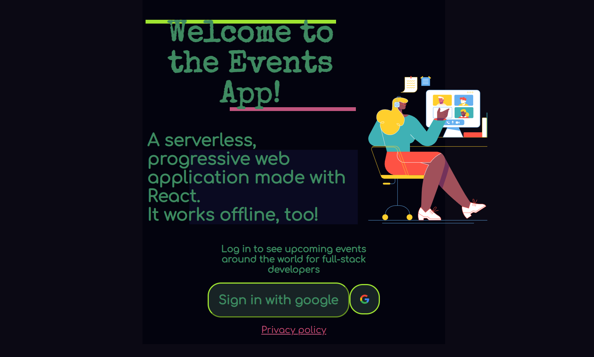
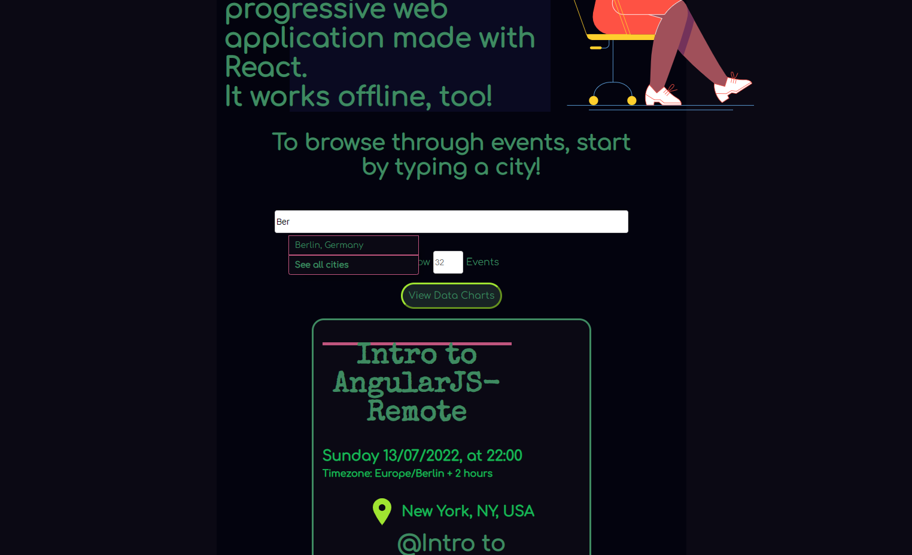
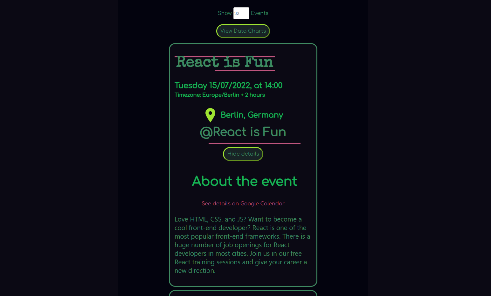
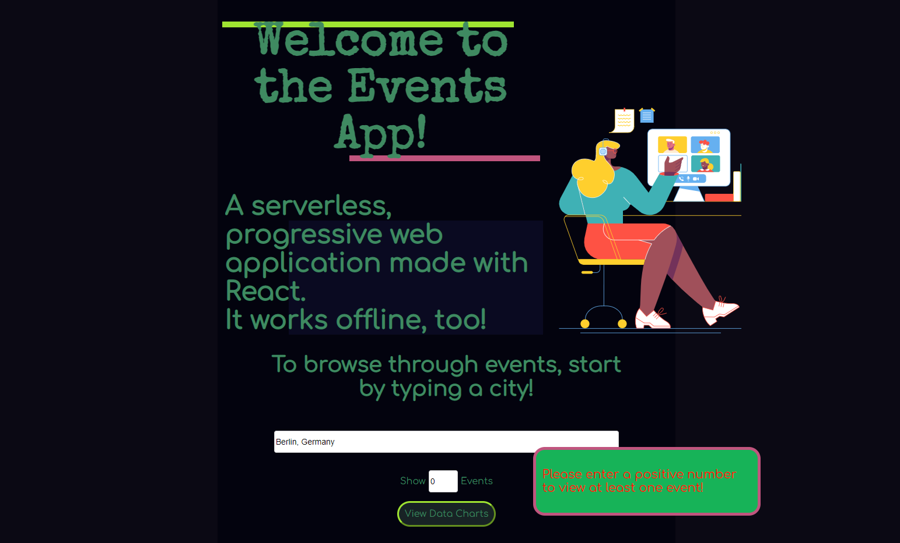
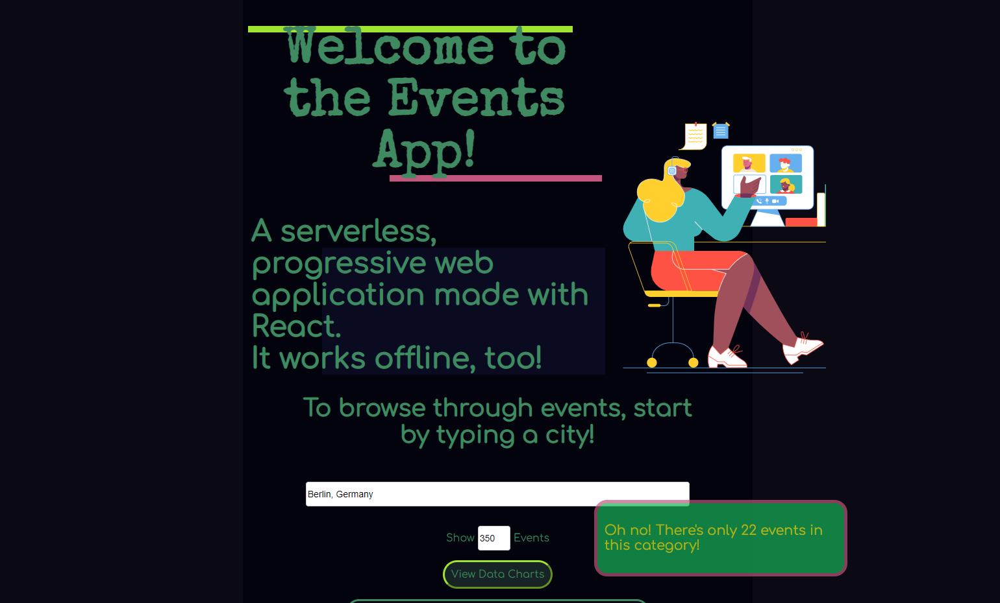
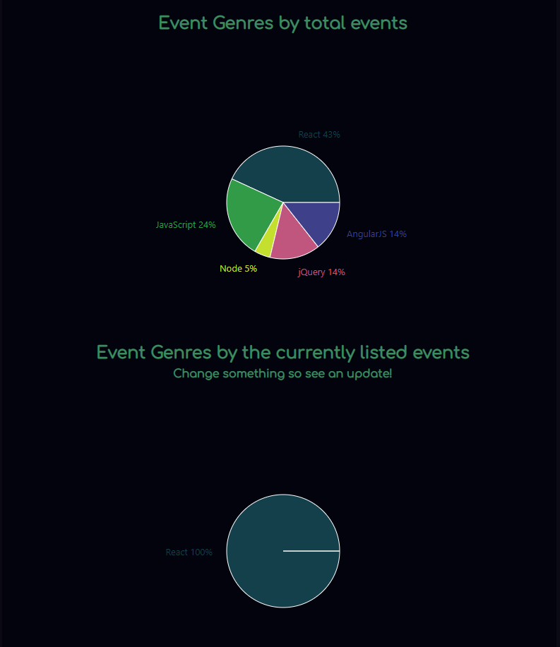
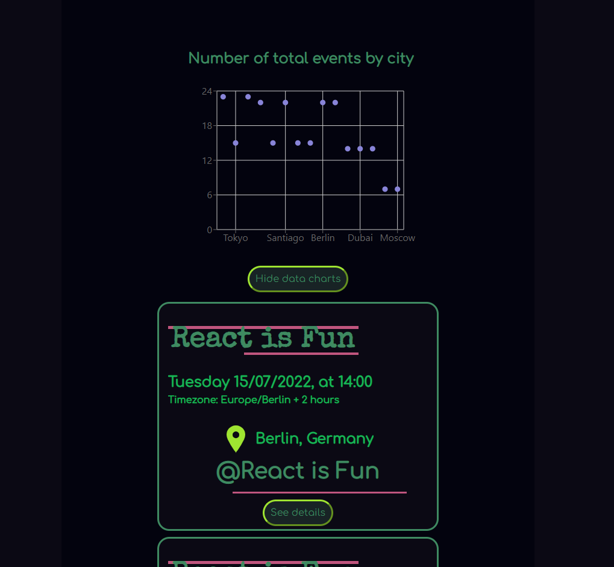

# Events app
Events app is a serverless, progressive web application (PWA) created with React and using a test-driven development (TDD) technique. 
The application uses the Google Calendar API to fetch upcoming events.

### Link to [live site](https://valvegan.github.io/events_app/)

## Technologies
- React 
- Cucumber (acceptance testing)
- Jest (unit and integration testing)
- Puppeteer (end-to-end testing)
- AWS Lambda (cloud provider)
- Recharts (library for data visualisation)
- Axios (library for asynchronous calls to the Google Calendar API)

## Own reflections on the project
This project has been a completely new embarkment into the world of serverless and testing processes for me. From serverless functions and cloud providers, to continuous delivery and integration processes, Google authorizations and private APIs...most of it was all new! The project didn't seem like much from the initial brief I had received, but obviously there was much more to than plain JavaScript code! 

If I could, I would probably spend more time reading the documentation new libraries and/or frameworks. It always feels like it's a bit of a waste of time (like one could just "google it" if they don't know how to complete a small task, right? well...not everytime), but it really does help with knowing what to do and ultimately completing a task more quickly. 

## Setting up the development environment 
- Create-React-App (CRA, boilerplate generator)
>npx create-react-app (application_name) --template cra-template-pwa --use-npm
>npm install
-Install github pages as dev dependency 
>npm install --save-dev gh-pages
- To add your remote URL so you can link your local project to the GitHub repository
>git init
>git remote add origin (github repo link)
- To push commited changes:
>git push --set-upstream origin main
- to deploy
>npm run deploy

### Creating an Authentication Server
- Install the Google APIs package
>npm install googleapis@^59.0.0 --save
- Install serverless (to create an authorization server)
>npm install -g serverless 
- Create a new serverless service/project using aws-nodejs
>serverless create --template aws-nodejs --path auth-server
- Create a package.json inside the newly created directory
>npm init
- Configure your AWS credentials for Serverless 
>serverless config credentials --provider aws --key ACCESS_KEY_ID --secret SECRET_ACCESS_KEY
- To test a serverless function locally
>serverless invoke local --function getAuthURL
- to deploy your serverless function
>serverless deploy
- Obtain serverless API endpoints
>serverless info
- Install the http-server package
>npm install http-server -g
- Install Axios
>npm install axios --save
- Install Recharts library
>npm i --save recharts

## Launch
>npm run start

## Testing
- Install Enzyme (testing utility for React, which allows shallow rendering through Jest)
>npm install --save-dev enzyme
- To run tests
>npm run test
- Install Jest-Cucumber (for acceptance tests)
>npm i jest-cucumber --save-dev
- Install Puppeteer (for end to end tests)
>npm i --save-dev puppeteer

## App features
- [x] Welcome page

- [x] Events can be filtered by city

- [x] Show/hide (more information) buttons on event entries

- [x] The event list can be altered to show more or less events (default is at 32) - if 0 is selected, or a higher number than the events that are available, an error message will pop up 

- [x] The app is available to use offline 

- [x] Option to add an app shortcut to the home screen

- [x] Charts showing data regarding the upcoming events, by city and in total

## User stories and test scenarios

### 1. FILTER EVENTS BY CITY
- **User Story:** as a user, I would like to be able to filter events by city so that I can see the list of events that take place in that city
 1. #### **Scenario 1:** When user hasn’t searched for a city, show upcoming events from all cities.
- **Given** user hasn’t searched for any city
- **When** the user opens the app
- **Then** the user should see a list of all upcoming events

 2. #### **Scenario 2:** user should see a list of suggestions when they search for a city.
- **Given** the main page is open
- **When** user starts typing in the city textbox
- **Then** the user should see a list of cities (suggestions) that match what they’ve typed

 3. #### **Scenario 3:** user can select a city from the suggested list.
- **Given** the user was typing “Berlin” in the city textbox and the list of suggested cities is showing
- **When** the user selects a city (e.g., “Berlin, Germany”) from the list
- **Then** their city should be changed to that city and the user should receive a list of upcoming events in that city

### 2. SHOW/HIDE AN EVENT'S DETAILS
- **User Story:** as a user, I would like to be able to show/hide event details so that I can see more/less information about an event.
 1. #### **Scenario 1:** An event element is collapsed by default
- **Given** the main page has been opened (either if no city is selected, or if a city is selected) and a list of events has been loaded 
- **When** the user opens the app and/or selects a specific city
- **Then** they will see a list of upcoming events with minimal information
 2. #### **Scenario 2:** User can expand an event to see its details
- **Given** the main page has been opened and a list of events has been loaded (either on the main page or when a city is selected) 
- **When** the user clicks on the "show more information" button
- **Then** they will see more information regarding a specific event
 3. #### **Scenario 3:** User can collapse an event to hide its details
- **Given** the main page has been opened and the event information has been expanded
- **When** the user clicks on the "show less information" button
- **Then** they will see less information regarding an event they expanded prior
 
### 3. SPECIFY NUMBER OF EVENTS
 1. #### **Scenario 1:** When user hasn’t specified a number, 32 is the default number
- **User Story:** as a user, I would like to be able to specify the number of events I want to view in the app so that I can see more or fewer events in the events list at once.
- **Given** the main page has been opened and a list of events has been loaded 
- **When** the user scrolls down the page
- **Then** they will only see 32 events by default
 2. #### **Scenario 2:** User can change the number of events they want to see
- **Given** the user has selected a city and a list of events has been loaded
- **When** the user focuses on the label that specifies the number of viewable events,
- **Then** the user will be able to alter the number and view more or less events

### 4. USE THE APP WHEN OFFLINE
- **User Story:** as a user I would like to be able to use the app when offline so that I can see the events I viewed the last time I was online
 1. #### **Scenario 1:** Show cached data when there’s no internet connection
- **Given** any user activity has been conducted on the page while online 
- **When** the user internet connection is offline
- **Then** the user will still see the information that had previously been loaded, via caches
 2. #### **Scenario 2:** Show error when user changes the settings (city, time range)
- **Given** the user has already selected a city and submitted other settings 
- **When** the user changes the settings
- **Then** an error message will display 

### 5. DATA VISUALIZATION
- **User Story:** as a user, I would like to be able to see a chart showing the upcoming events in each city so that I know what events are organized in which city.
 1. #### **Scenario 1:** Show a chart with the number of upcoming events in each city
- **Given** the user has selected a city and the list of events (in that city) has been loaded
- **When** the user clicks on an icon/button that specifies more data about the events in that city 
- **Then** a chart with more data (such as the total number of upcoming events) will be displayed to the user

